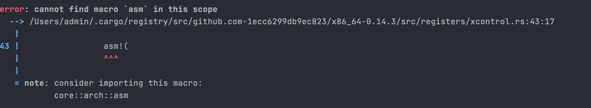
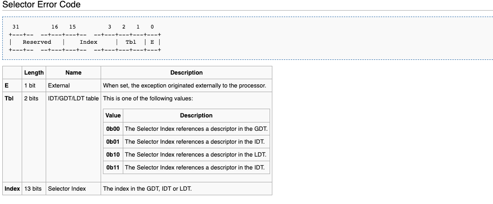

# x86_64 操作系统 write in rust

💗💗💗💗


## How to use

```sh
cargo build
```

```sh
cargo run
```

如果


```shell
# 报错尝试
rustup component add rust-src llvm-tools-preview
```

这个


### Commands

绑定环境

```sh
cargo rustc -- -C link-args="-e __start -static -nostartfiles"
```

**从源码编译 **

```sh
rustup component add rust-src
```

**使用**


```sh
cargo run
```


> inspiration by https://os.phil-opp.com/
